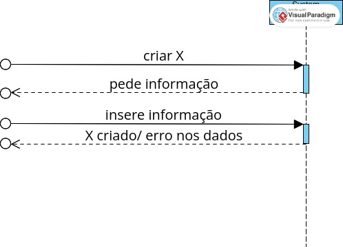

	## Contents
- [Views](#views)
	- [Introduction]()
	- [Nível 1](#nível-1)
		- [Vista Lógica](#vista-lógica)
		- [Vista de Processos](#vista-de-processos)
       - [SSD US360](#ssd-us360)
       - [SSD US350](#ssd-us350)
    - [SSD US380](#ssd-us380)
    - [SSD US370](#ssd-us370)
    - [SSD Criação de X](#ssd-criação-de-x)
    - [SSD Edição de X](#ssd-edição-de-x)
    - [SSD Eliminação de X](#ssd-eliminação-de-x)
    - [SSD Listagem de X](#ssd-listagem-de-x)
    - [Vista de Cenários](#vista-de-cenários)

    - [Nível 2](#nível-2)
      - [Vista Lógica](#vista-lógica-1)
      - [Vista de Implementação](#vista-de-implementação)
    - [Nível 3 (MDR)](#nível-3-mdr)
      - [Vista Lógica](#vista-lógica-2)
      - [Vista de Processos](#vista-de-processos)
        - [SD US01](#sd-us01)
      - [Vista de Implementação](#vista-de-implementação-1)

# Views

## Introduction
Será adotada a combinação de dois modelos de representação arquitetural: C4 e 4+1.

O Modelo de Vistas 4+1 [[Krutchen-1995]](References.md#Kruchten-1995) propõe a descrição do sistema através de vistas complementares permitindo assim analisar separadamente os requisitos dos vários stakeholders do software, tais como utilizadores, administradores de sistemas, project managers, arquitetos e programadores. As vistas são deste modo definidas da seguinte forma:

- Vista lógica: relativa aos aspetos do software visando responder aos desafios do negócio;
- Vista de processos: relativa ao fluxo de processos ou interações no sistema;
- Vista de desenvolvimento: relativa à organização do software no seu ambiente de desenvolvimento;
- Vista física: relativa ao mapeamento dos vários componentes do software em hardware, i.e. onde é executado o software;
- Vista de cenários: relativa à associação de processos de negócio com atores capazes de os espoletar.

O Modelo C4 [[Brown-2020]](References.md#Brown-2020)[[C4-2020]](References.md#C4-2020) defende a descrição do software através de quatro níveis de abstração: sistema, contentor, componente e código. Cada nível adota uma granularidade mais fina que o nível que o antecede, dando assim acesso a mais detalhe de uma parte mais pequena do sistema. Estes níveis podem ser equiparáveis a mapas, e.g. a vista de sistema corresponde ao globo, a vista de contentor corresponde ao mapa de cada continente, a vista de componentes ao mapa de cada país e a vista de código ao mapa de estradas e bairros de cada cidade.
Diferentes níveis permitem contar histórias diferentes a audiências distintas.

Os níveis encontram-se definidos da seguinte forma:
- Nível 1: Descrição (enquadramento) do sistema como um todo;
- Nível 2: Descrição de contentores do sistema;
- Nível 3: Descrição de componentes dos contentores;
- Nível 4: Descrição do código ou partes mais pequenas dos componentes (e como tal, não será abordado neste DAS/SAD).

Pode-se dizer que estes dois modelos se expandem ao longo de eixos distintos, sendo que o Modelo C4 apresenta o sistema com diferentes níveis de detalhe e o Modelo de Vista 4+1 apresenta o sistema de diferentes perspetivas. Ao combinar os dois modelos torna-se possível representar o sistema de diversas perspetivas, cada uma com vários níveis de detalhe.

Para modelar/representar visualmente, tanto o que foi implementado como as ideias e alternativas consideradas, recorre-se à Unified Modeling Language (UML) [[UML-2020]](References.md#UML-2020) [[UMLDiagrams-2020]](References.md#UMLDiagrams-2020).

## Nível 1
### Vista Lógica

### Vista de Processos
#### SSD US360

#### SSD US350

#### SSD US380

#### SSD US370

#### SSD Criação de X

#### SSD Edição de X

#### SSD Eliminação de X

#### SSD Listagem de X

#### Vista de Cenários

## Nível 2
### Vista Lógica

### Vista de Implementação

## Nível 3 (MDR)
### Vista Lógica

### Vista de Processos

#### SD US220 Listar Pisos de Edificios com Passagens para Outros Edificios

#### SD US250 Editar Passagem entre Edificios

#### SD 310 Criar Sala de Piso de Edificio

#### (outros SSD arquiteturalmente relevantes)
[...]

### Vista de Implementação

